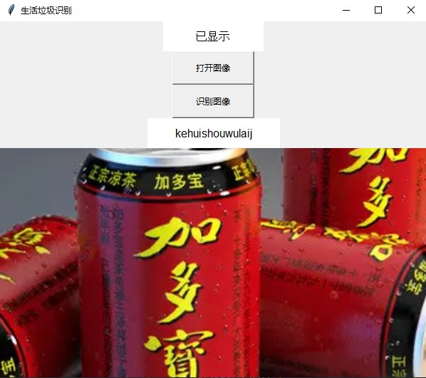

# 基于VGG16Net网络模型的生活垃圾分类研究

----

随着时代的发展，生活垃圾分类处理显得逐渐重要，此项目实现了生活垃圾图像种类识别的要求。
本文基于python3.8和VScode IDLE的平台进行搭建。

## 项目文件目录树结构

---

```
rubbish:.
├─.idea
│  └─inspectionProfiles
├─Data
│  └─rubbishdata
│      ├─train
│      │  ├─chuyulaji
│      │  ├─kehuishouwulaij
│      │  ├─qitalaji
│      │  └─youhailaji
│      └─val
│          ├─chuyulaji
│          ├─kehuishouwulaij
│          ├─qitalaji
│          └─youhailaji
├─loss_acc_jpg
├─model
│  └─__pycache__
├─pth
├─train
└─图片_论文
    └─图片
```

## 环境需求

---

    GPU                 RTX2070
    CUDA                11.2
    cudnn               8.1.0
    torch               2.0.0+cu17
    torchvision         0.15.1+cu17
    torchaudio          2.0.1+cu11
    matplotlib          3.7.1
    pandas              2.0.0
    tqdm                4.65.0
    torchsummary        1.5.1

## 环境搭建过程

---

### `conda 虚拟环境搭建`（CUDA和CUDNN成功配置完成）前提下
```bash
conda create -n torch-gpu python=3.8

conda activate torch-gpu
```
```bash
pip3 install torch torchvision torchaudio --index-url https://download.pytorch.org/whl/cu117

pip3 install matplotlib -i http://mirrors.aliyun.com/pypi/simple --trusted-host mirrors.aliyun.com

pip3 install pandas -i http://mirrors.aliyun.com/pypi/simple --trusted-host mirrors.aliyun.com

pip3 install torchsummary -i http://mirrors.aliyun.com/pypi/simple --trusted-host mirrors.aliyun.com

pip3 install tqdm -i http://mirrors.aliyun.com/pypi/simple --trusted-host mirrors.aliyun.com
```

数据集采用的是华为云人工智能大赛垃圾分类挑战杯的垃圾分类数据集，数据集包含25143张图片，这些图片涵盖了4类垃圾（厨余垃圾、可回收垃圾、有害垃圾和其他垃圾）。

## 网络选择和超参数设置

---

这里选择了 `LeNet`、`AlexNet`和`VGG16Net`三种经典的网络模型，搭建源码如下：
```python
# LeNet5
# coding utf-8
# Author : innerfear1
# IDLE : VScode
self.conv1 = nn.Conv2d(in_channels=3,out_channels=6,kernel_size=5)
        self.pool1 = nn.MaxPool2d(kernel_size=2,stride=2)
        self.conv2 = nn.Conv2d(in_channels=6,out_channels=16,kernel_size=5)
        self.pool2 = nn.MaxPool2d(kernel_size=2,stride=2)

        self.fc1 = nn.Linear(16*53*53,120)
        self.fc2 = nn.Linear(120,84)
        self.fc3 = nn.Linear(84,4)
        
# AlexNet
# input为224*224*3 96个卷积核11*11*3 
self.conv1 = nn.Conv2d(in_channels=3,out_channels=96,kernel_size=11,stride=4,padding=0)
# self.LRN1 = nn.LocalResponseNorm(size=5, alpha=0.0001, beta=0.75, k=2)
self.pool1 = nn.MaxPool2d(kernel_size=3,stride=2)
# input为27*27*96 256个卷积核5*5*96
self.conv2 = nn.Conv2d(in_channels=96,out_channels=256,kernel_size=5,stride=1,padding=2)
# self.LRN2 = nn.LocalResponseNorm(size=5, alpha=0.0001, beta=0.75, k=2)
self.pool2 = nn.MaxPool2d(kernel_size=3,stride=2)
# input为13*13*256 384个卷积核3*3*256
self.conv3 = nn.Conv2d(in_channels=256,out_channels=384,kernel_size=3,stride=1,padding=1)
# input为13*13*384 384个卷积核3*3*384
self.conv4 = nn.Conv2d(in_channels=384,out_channels=384,kernel_size=3,stride=1,padding=1)
# input为13*13*384 256个卷积核3*3*384
self.conv5 = nn.Conv2d(in_channels=384,out_channels=256,kernel_size=3,stride=1,padding=1)
self.pool5 = nn.MaxPool2d(kernel_size=3,stride=2)
        
# VGG16Net
self.layer1 = nn.Sequential(
            nn.Conv2d(in_channels=3,out_channels=64,kernel_size=3,stride=1,padding=1),
            nn.BatchNorm2d(64),
            nn.ReLU(inplace=True),
            nn.Conv2d(in_channels=64,out_channels=64,kernel_size=3,stride=1,padding=1),
            nn.BatchNorm2d(64),
            nn.ReLU(inplace=True),
            nn.MaxPool2d(kernel_size=2,stride=2)
        )

        # input为112*112*64 128个卷积核，2层卷积
        self.layer2 = nn.Sequential(
            nn.Conv2d(in_channels=64,out_channels=128,kernel_size=3,stride=1,padding=1),
            nn.BatchNorm2d(128),
            nn.ReLU(inplace=True),
            nn.Conv2d(in_channels=128,out_channels=128,kernel_size=3,stride=1,padding=1),
            nn.BatchNorm2d(128),
            nn.ReLU(inplace=True),
            nn.MaxPool2d(kernel_size=2,stride=2)
        )
        
        # input为56*56*128 256个卷积核，3层卷积
        self.layer3 = nn.Sequential(
            nn.Conv2d(in_channels=128,out_channels=256,kernel_size=3,stride=1,padding=1),
            nn.BatchNorm2d(256),
            nn.ReLU(inplace=True),
            nn.Conv2d(in_channels=256,out_channels=256,kernel_size=3,stride=1,padding=1),
            nn.BatchNorm2d(256),
            nn.ReLU(inplace=True),
            nn.Conv2d(in_channels=256,out_channels=256,kernel_size=3,stride=1,padding=1),
            nn.BatchNorm2d(256),
            nn.ReLU(inplace=True),
            nn.MaxPool2d(kernel_size=2,stride=2)
        )

        # input为28*28*256 512个卷积核，3层卷积
        self.layer4 = nn.Sequential(
            nn.Conv2d(in_channels=256,out_channels=512,kernel_size=3,stride=1,padding=1),
            nn.BatchNorm2d(512),
            nn.ReLU(inplace=True),
            nn.Conv2d(in_channels=512,out_channels=512,kernel_size=3,stride=1,padding=1),
            nn.BatchNorm2d(512),
            nn.ReLU(inplace=True),
            nn.Conv2d(in_channels=512,out_channels=512,kernel_size=3,stride=1,padding=1),
            nn.BatchNorm2d(512),
            nn.ReLU(inplace=True),
            nn.MaxPool2d(kernel_size=2,stride=2)
        )
        
        # input为14*14*512 521个卷积核 ，3层卷积
        self.layer5 = nn.Sequential(
            nn.Conv2d(in_channels=512,out_channels=512,kernel_size=3,stride=1,padding=1),
            nn.BatchNorm2d(512),
            nn.ReLU(inplace=True),
            nn.Conv2d(in_channels=512,out_channels=512,kernel_size=3,stride=1,padding=1),
            nn.BatchNorm2d(512),
            nn.ReLU(inplace=True),
            nn.Conv2d(in_channels=512,out_channels=512,kernel_size=3,stride=1,padding=1),
            nn.BatchNorm2d(512),
            nn.ReLU(inplace=True),
            nn.MaxPool2d(kernel_size=2,stride=2)
        )
        # 卷积层
        self.conv = nn.Sequential(
            self.layer1,
            self.layer2,
            self.layer3,
            self.layer4,
            self.layer5
        )

        # input为512*7*7 全连接层
        self.fc = nn.Sequential(
            nn.Linear(512*7*7,4096),
            nn.ReLU(inplace=True),
            nn.Dropout(0.5),
            nn.Linear(4096,4096),
            nn.ReLU(inplace=True),
            nn.Dropout(0.5),
            nn.Linear(4096,4)
        )
```
这里对神经元的处理均为 `relu` 函数激活。并且将三种模型全放入 `model` 文件夹中。

### LeNet网络模型结构

----


这里对此模型进行了修改，（32，32，1）的输入修改为（224，224，3）的输入。

|      网络层       |      输入维度      | 卷积核维度和步长或神经元个数 | 池化维度和步长 |    输出维度     | 
|:--------------:|:--------------:|:--------------:|:-------:|:-----------:|
| covn1+maxpool1 |  (224,224,3)   |   (5,5,6)，1    | (2,2)，1 | (112，112，6) |
| conv2+maxpool2 |  (112,112,6)   |   (5,5,16),1   | (2,2),1 | (53,53,16)  |
| fc1 | ((53,53,16),1) | 120 |  NULL   |   (120，1）   |
| fc2 | (120,1) | 84 |  NULL   |   (84,1)    |
|fc3 | (84,1) | 4 | NULL | (4,1) |

下图是迭代训练100轮后的acc与loss曲线图


### AlexNet网络结构

---
下图即为AlexNet的网络结构图，同样也在 `model` 文件夹中。


这里对其网络结构做了统一化，将2个GPU进程改为1个，网络输入输出如下：

|      网络层       |     输入维度      | 卷积核维度和步长或神经元个数  | 池化维度和步长 |    输出维度     | 
|:--------------:|:-------------:|:---------------:|:-------:|:-----------:|
| covn1+maxpool1 |  (224,224,3)  |  (11,11,96)，4   | (3,3)，2 | (27，27，96)  |
| conv2+maxpool2 |  (27,27,96)   | (5,5,256),1 p=2 | (3,3),1 | (13,13,256) |
|     conv3      |  (13,13,256)  | (3,3,384),1 p=1 | NULL | (13,13,384) |
|     conv4      |  (13,13,384)  | (3,3,384),1 p=1 | NULL | (13,13,384) |
| conv5+maxpool5 |  (13,13,384)  | (3,3,256),1 p=1 | (3,3),2 | (6,6,256) |
|    fc1+drop    | ((6,6,256),1) |      4096       |  NULL   |  (4096，1）   |
|    fc2+drop    |   (4096,1)    |      4096       |  NULL   |  (4096,1)   |
|      fc3       |   (4096,1)    |        4        |  NULL   |    (4,1)    |

下图是迭代训练100轮后的acc与loss曲线图


### VGG16Net的网络结构

---

这里使用的是VGG16Net，也就是D类网络结构


此处不展示网络层的表格。

## GUI界面的使用

---
这里使用python3自带的 `tkinter` 库做出的简易GUI界面，源代码文件名为 `predict_gui.py` ，示例效果如下：



可以先点击 `打开图像按键` 进行图像展示，之后点击 `识别图像按键` 在下方会显示出来此生活垃圾图片的种类。